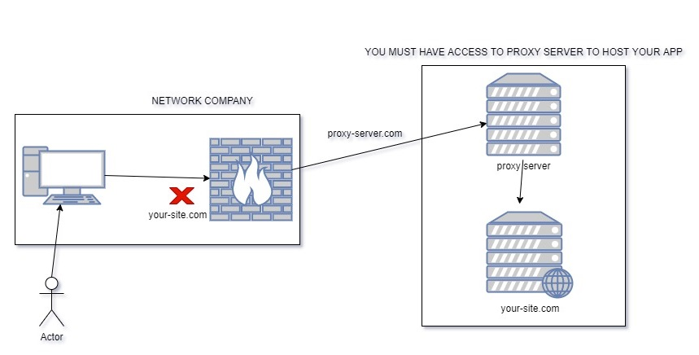

# Proxy Tcp Client

This demo implements a simple proxy tcp client which bypass the rules of the firewall. It reads bytes from localhost:8080 and send them
to localhost:80 and get back the requests.

## How to check it

You need to have something listening on port 80 like a nginx or something like so when you
visit a page with your navigator on http://localhost:8080 you should be forwarded to http://localhost:80. 
Your localhost:80 represent the site locked by the firewall.

